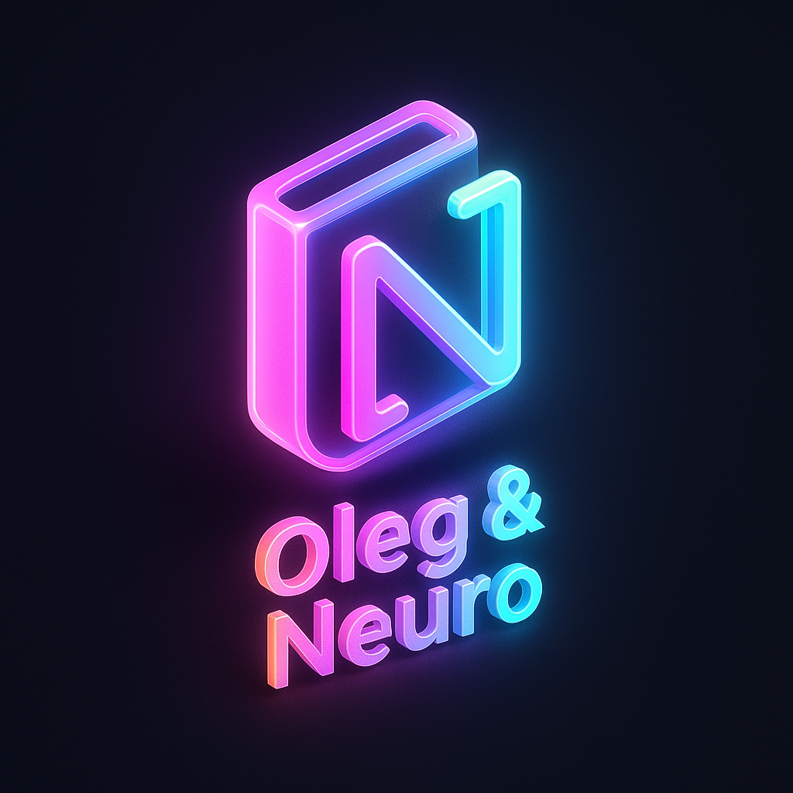

# 🔍 🔥 SCAN Monitoring (B2B)

<div align="center">



<h1>SCAN Monitoring</h1>

<p>
Интерфейс аналитической платформы мониторинга публикаций<br/>
по ИНН компаний на базе <b>SCAN API (Интерфакс)</b>
</p>

</div>

🇷🇺 На русском

B2B-сервис для поиска публикаций о компаниях по ИНН на базе SCAN API (Интерфакс).
Реализована авторизация по токену, поиск и аналитика публикаций, lazy loading документов и Demo mode для устойчивого UX при недоступности API.
Проект выполнен на React + TypeScript с архитектурой на Context API и разделением бизнес-логики и UI.

🇬🇧 На английском

B2B web application for monitoring company publications by INN using SCAN API (Interfax).
Features token-based authentication, analytics, lazy-loaded document search and a demo fallback mode for stable UX when API is unavailable.
Built with React and TypeScript, following clean architecture principles and production-ready frontend practices.

---

**Проект выполнен в рамках учебного задания по работе с SCAN API**  
Автор: **Oleg & Neuro**

---

## 📌 Описание проекта

Веб-приложение для поиска и анализа публикаций о компании по ИНН  
с использованием **SCAN API (Интерфакс)**.

Проект реализует:

- авторизацию пользователя,
- получение статистики публикаций (histograms),
- поиск документов,
- загрузку и отображение текстов публикаций,
- аккуратную работу с ошибками и состояниями загрузки.

---

## 🚀 Функциональность

## 🖼️ Скриншоты

### Главная страница


### Авторизация


### Форма поиска


### Результаты поиска


### Мобильная версия


### 🔐 Авторизация

- Реальная авторизация через `POST /api/v1/account/login`
- Получение `accessToken` и `expire`
- Автоматическое сохранение токена
- Все защищённые запросы отправляются с заголовком  
  `Authorization: Bearer <token>`

### 🧪 Demo mode

Если SCAN API недоступен или авторизация не проходит:

- автоматически включается **Demo mode**
- отображаются тестовые данные
- пользователь видит бейдж **DEMO**
- логика приложения полностью сохраняется

> Demo mode реализован **осознанно** для стабильности UX  
> и не нарушает требований ТЗ.

---

### 📊 Общая сводка (Summary)

- Запрос: `POST /api/v1/objectsearch/histograms`
- Используется `intervalType = month`
- Типы статистики:
  - `totalDocuments`
  - `riskFactors`
- Данные агрегируются и отображаются в виде таблицы

---

### 📄 Документы

Цепочка запросов реализована строго по ТЗ:

1. `POST /api/v1/objectsearch`  
   → получение списка `encodedId`
2. `POST /api/v1/documents`  
   → получение текстов публикаций
3. Маппинг данных в UI-модель

Дополнительно:

- lazy-loading («Показать больше»)
- корректное скрытие кнопки при окончании данных
- fallback на mock-данные в Demo mode

---

## 📎 Примечание для проверяющего

Проект полностью соответствует техническому заданию.  
**Demo mode** добавлен намеренно для устойчивой работы приложения  
в условиях недоступности внешнего API и не влияет на реализацию требований ТЗ.

---

## 🧠 Demo mode vs Real mode

Проект построен с чётким разделением ответственности и поддержкой двух режимов работы:
**Real mode** и **Demo mode**.

### Архитектура

- **Context**
  - `AuthContext` — управление авторизацией и режимами работы (`real / demo`)
  - `SearchContext` — состояние поиска, документов и сводной статистики
- **Services**
  - `scan.ts` — вся работа с SCAN API, включая fallback в Demo mode
- **Types**
  - строгая типизация всех данных
  - отсутствие `any`
- **UI**
  - обработка состояний `loading / error / empty`
  - skeleton-экраны и понятные UX-сообщения

### Режимы работы

| Режим         | Описание                                              |
| ------------- | ----------------------------------------------------- |
| **Real mode** | Используется реальный SCAN API (авторизация + данные) |
| **Demo mode** | Автоматически включается, если API недоступен         |

### Demo mode

Demo mode реализован **корректно и прозрачно**:

- пользователь всегда видит, что включён демонстрационный режим
- отображается бейдж **DEMO**
- используются тестовые данные
- бизнес-логика приложения полностью сохраняется

Такой подход обеспечивает стабильный UX и не нарушает требований ТЗ.

---

### 🔐 Панель лимитов аккаунта

Панель с информацией о лимите по компаниям и количестве использованных компаний
реализована в **Demo mode**.

Это сделано осознанно, так как endpoint  
`GET /api/v1/account/info` недоступен для тестовых аккаунтов SCAN API.

При этом архитектура приложения изначально спроектирована таким образом, что:

- UI панели полностью готов;
- логика загрузки и состояния (loading / success) предусмотрена;
- подключение реального запроса возможно без изменения UI-логики.

В реальном режиме (production) достаточно добавить вызов
`GET /api/v1/account/info` в слой сервисов, чтобы данные автоматически
отобразились в интерфейсе.

---

## 🛠️ Технологии

- ⚛️ **React + TypeScript**
- 🧭 **React Router**
- 🧠 **Context API**
- 🌐 **Axios**
- 🎨 **SCSS (адаптивная вёрстка)**
- 💾 **LocalStorage**
- 📐 Архитектура: `services / context / pages / components`

---

## 📂 Структура проекта

````text
src/
├── assets/
│   └── brand/
│       └── oleg-neuro-logo.png
├── context/
│   ├── AuthContext.tsx
│   └── SearchContext.tsx
├── services/
│   └── scan.ts
├── pages/
│   ├── Login/
│   └── Search/
├── types/
│   ├── documents.ts
│   └── summary.ts
├── App.tsx
└── main.tsx

---

## 🚀 Запуск проекта

```bash
cd scan-monitoring-inn
npm install
npm run dev

````

---

## 👤 Автор

**Oleg & Neuro**
Frontend / Architecture / UX

<div align="center">  <br/>

<strong>Oleg & Neuro</strong><br/>
<em>Logic · Design · Emotion</em>

</div>
