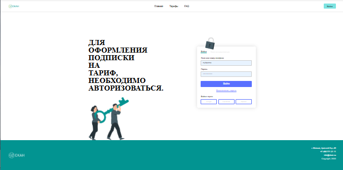
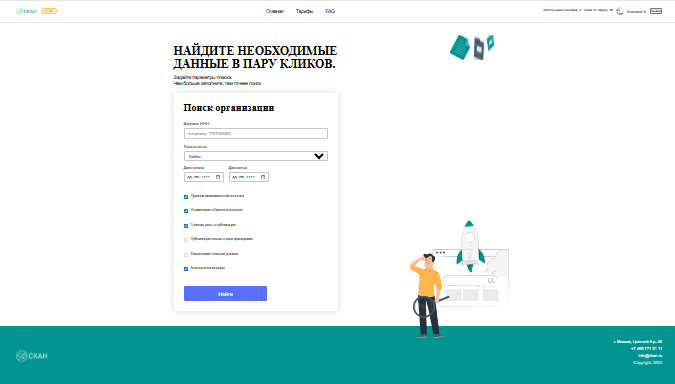
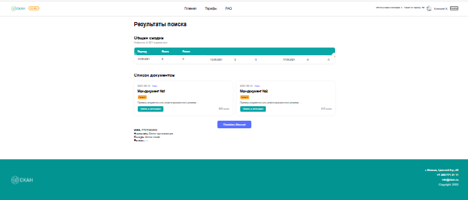

<p align="center">
  🌍 <strong>Languages:</strong><br><br>

  

  <a href="./README_EN.md">
    
  </a>
</p>

<br><hr><br>

# 🔍🔥 SCAN Monitoring (B2B)

<p align="center">
  <a href="https://scan-monitoring-inn.vercel.app">
    
  </a>
  <a href="https://olegmbq.github.io/scan-monitoring-inn/">
    
  </a>
</p>

<br><hr><br>

<div align="center">
  

  <h1>SCAN Monitoring</h1>

  <p>
    Аналитическая B2B-платформа мониторинга публикаций<br/>
    по ИНН компаний на базе <b>SCAN API (Интерфакс)</b>
  </p>
</div>

<br>

<div align="center">
  
  
  
  <br><br>
  
  
  
</div>

<br><hr><br>

## 🇷🇺 Описание (RU)

B2B-сервис для поиска публикаций о компаниях по ИНН  
на базе **SCAN API (Интерфакс)**.

Реализованы:

- авторизация по токену
- поиск и аналитика публикаций
- ленивая загрузка документов
- **Demo mode** для устойчивого UX при недоступности API

Проект выполнен на **React + TypeScript**  
с архитектурой на **Context API** и разделением бизнес-логики и UI.

<br><hr><br>

## 🇬🇧 Description (EN)

B2B web application for monitoring company publications by INN  
using **SCAN API (Interfax)**.

Features:

- token-based authentication
- analytics and document search
- lazy loading
- **demo fallback mode** for stable UX when API is unavailable

Built with **React + TypeScript**, following clean architecture principles.

<br><hr><br>

## 🔍 Key Features

- Token-based authentication with persistent session (localStorage)
- Secure access control for authorized users
- Real SCAN API integration (login, histograms, documents)
- Demo mode with automatic fallback when API is unavailable
- Analytics summary with time-based histograms
- Lazy loading of documents (batch loading)
- Clean separation of business logic and UI
- Responsive layout for desktop and mobile

<br><hr><br>

## 🧠 Architecture Overview

- **Context API**
  - AuthContext — authentication, token handling, demo / real mode
  - SearchContext — search state, documents and analytics data
- **Services layer**
  - All API communication and demo fallback logic isolated in services
- **UI layer**
  - Loading, error and empty states handled consistently

<dr><hr><br>

**Проект выполнен в рамках учебного задания по работе с SCAN API**  
Автор: **Oleg & Neuro**

<br><hr><br>

## 🖼️ Скриншоты

### Главная страница


### Авторизация



### Форма поиска



### Результаты поиска



### Мобильная версия


<br><hr><br>

## 🚀 Функциональность

- Авторизация пользователя с сохранением сессии
- Автоматический Demo mode при недоступности API
- Поиск публикаций по ИНН с валидацией данных
- Аналитическая сводка публикаций и риск-факторов
- Просмотр публикаций с детальной информацией
- Ленивая загрузка документов (batch loading)
- Защита страниц для неавторизованных пользователей
- Адаптивный интерфейс для desktop и mobile

<br><hr><br>

### 🔐 Авторизация

<br><hr><br>

- Реальная авторизация через `POST /api/v1/account/login`
- Получение `accessToken` и `expire`
- Автоматическое сохранение токена
- Все защищённые запросы отправляются с заголовком  
  `Authorization: Bearer <token>`

  <br><hr><br>

### 🧪 Demo mode

<br><hr><br>

Если SCAN API недоступен или авторизация не проходит:

- автоматически включается **Demo mode**
- отображаются тестовые данные
- пользователь видит бейдж **DEMO**
- логика приложения полностью сохраняется

> Demo mode реализован **осознанно** для стабильности UX  
> и не нарушает требований ТЗ.

<br><hr><br>

### 📊 Общая сводка (Summary)

<dr><hr><br>

- Запрос: `POST /api/v1/objectsearch/histograms`
- Используется `intervalType = month`
- Типы статистики:
  - `totalDocuments`
  - `riskFactors`
- Данные агрегируются и отображаются в виде таблицы

<br><hr><br>

### 📄 Документы

<br><hr><br>

Цепочка запросов реализована строго по ТЗ:

1. `POST /api/v1/objectsearch`  
   → получение списка `encodedId`
2. `POST /api/v1/documents`  
   → получение текстов публикаций
3. Маппинг данных в UI-модель

Дополнительно:

- lazy-loading («Показать больше»)
- корректное скрытие кнопки при окончании данных
- fallback на mock-данные в Demo mode

<br><hr><br>

## 📎 Примечание для проверяющего

Проект полностью соответствует техническому заданию.  
**Demo mode** добавлен намеренно для устойчивой работы приложения  
в условиях недоступности внешнего API и не влияет на реализацию требований ТЗ.

<br><hr><br>

## 🧠 Demo mode vs Real mode

Проект построен с чётким разделением ответственности и поддержкой двух режимов работы:
**Real mode** и **Demo mode**.

<br><hr><br>

### Режимы работы

<br><hr><br>

| Режим         | Описание                                              |
| ------------- | ----------------------------------------------------- |
| **Real mode** | Используется реальный SCAN API (авторизация + данные) |
| **Demo mode** | Автоматически включается, если API недоступен         |

<br><hp><br>

### Demo mode

<br><hr><br>

Demo mode реализован **корректно и прозрачно**:

- пользователь всегда видит, что включён демонстрационный режим
- отображается бейдж **DEMO**
- используются тестовые данные
- бизнес-логика приложения полностью сохраняется

Такой подход обеспечивает стабильный UX и не нарушает требований ТЗ.

<br><hr><br>

### 🔐 Панель лимитов аккаунта

<br><hr><br>

Панель с информацией о лимите по компаниям и количестве использованных компаний
реализована в **Demo mode**.

Это сделано осознанно, так как endpoint  
`GET /api/v1/account/info` недоступен для тестовых аккаунтов SCAN API.

При этом архитектура приложения изначально спроектирована таким образом, что:

- UI панели полностью готов;
- логика загрузки и состояния (loading / success) предусмотрена;
- подключение реального запроса возможно без изменения UI-логики.

В реальном режиме (production) достаточно добавить вызов
`GET /api/v1/account/info` в слой сервисов, чтобы данные автоматически
отобразились в интерфейсе.

<br><hr><br>

## 🛠️ Технологии

- ⚛️ **React + TypeScript**
- 🧭 **React Router**
- 🧠 **Context API**
- 🌐 **Axios**
- 🎨 **SCSS (адаптивная вёрстка)**
- 💾 **LocalStorage**
- 📐 Архитектура: `services / context / pages / components`

<br><hr><br>

## 📂 Структура проекта

```text
src/
├── assets/
│   └── brand/
│       └── oleg-neuro-logo.png
├── context/
│   ├── AuthContext.tsx
│   └── SearchContext.tsx
├── services/
│   └── scan.ts
├── pages/
│   ├── Login/
│   └── Search/
├── types/
│   ├── documents.ts
│   └── summary.ts
├── App.tsx
└── main.tsx

```

<br><hr><br>

## 🚀 Запуск проекта

```bash
cd scan-monitoring-inn
npm install
npm run dev

```

<br><hr><br>

## 👤 Автор

**Oleg Martyanov & Neuro**
Frontend / Architecture / UX

<br><hr><br>

<div align="center">  <br/>

<strong>Oleg & Neuro</strong><br/>
<em>Logic · Design · Emotion</em>

</div>
